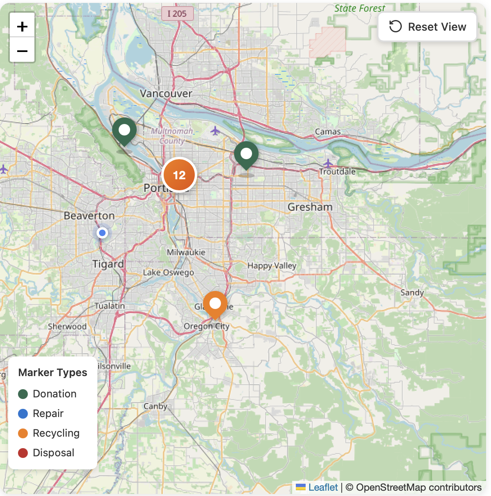
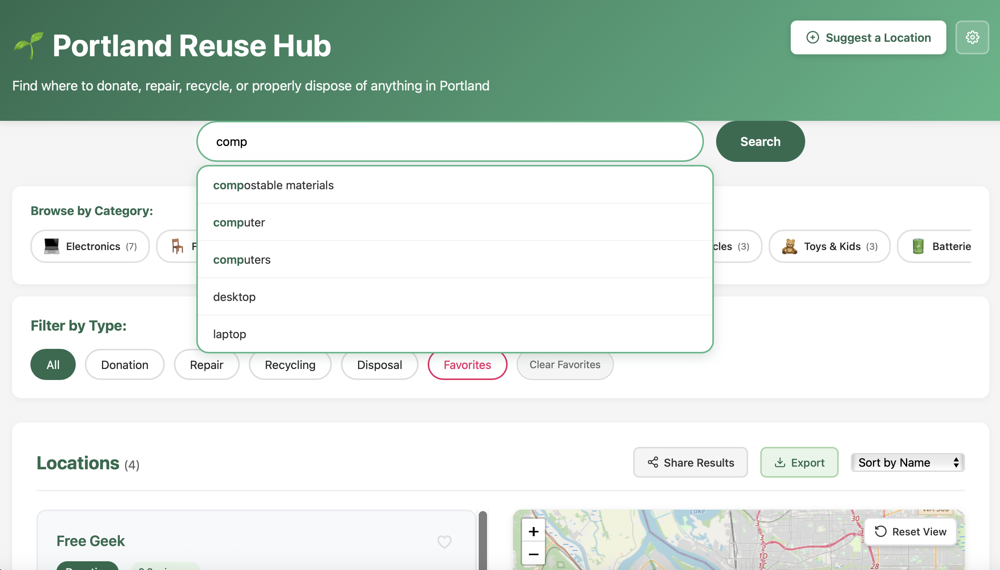
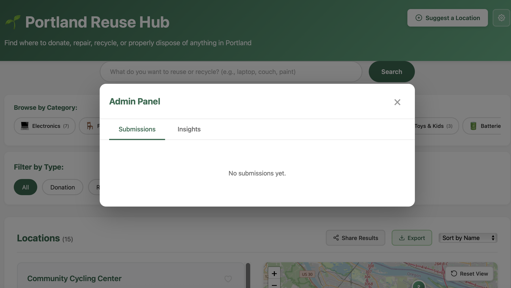
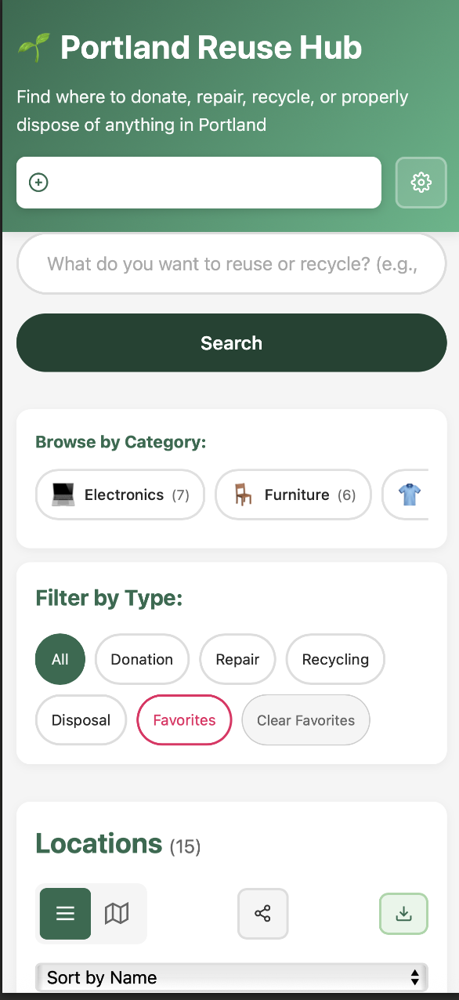

# 🌱 Portland Reuse Hub

Full-stack web platform helping Portland residents find reuse, repair, and recycling resources to reduce waste through circular economy principles.

**Live Demo:** [Coming soon - deploying to Render]  
**GitHub:** https://github.com/hickskelan-wq/portland-reuse-hub

---

## ✨ Features

### User Features
- 🗺️ **Interactive Map** - Browse 50+ Portland locations on Leaflet map with custom markers
- 🔍 **Smart Search** - Find locations by item type (electronics, furniture, clothing, etc.)
- 📍 **Advanced Filters** - Sort by donation, repair, recycling, or disposal type
- 📱 **Mobile Responsive** - Works great on phones, tablets, and desktop
- 💾 **Favorites** - Save your go-to locations (localStorage)
- 📊 **Category Chips** - Quick filter by popular item categories
- 👥 **Submit Locations** - Community can suggest new places

### Admin Features
- 🔐 **JWT Authentication** - Secure admin login
- ✅ **Approve/Reject** - Review community submissions
- 📈 **Analytics Dashboard** - Track searches, popular items, and usage
- 🗄️ **Database Management** - All data stored in PostgreSQL

---

## 🛠️ Tech Stack

**Frontend:**
- Vanilla JavaScript (ES6+)
- Leaflet.js for interactive maps with custom markers
- Responsive CSS with mobile-first design
- LocalStorage for favorites and client-side caching

**Backend:**
- Node.js & Express.js
- PostgreSQL database
- Prisma ORM for type-safe database queries
- JWT authentication with bcrypt password hashing
- RESTful API design

**DevOps:**
- Railway/Render for deployment
- GitHub for version control
- Nodemon for development

---

## 🚀 Local Development Setup

### Prerequisites
- Node.js 18+ ([Download](https://nodejs.org/))
- PostgreSQL 14+ ([Download](https://postgresapp.com/) for Mac)
- Git

### Installation

**1. Clone the repository:**
```bash
git clone https://github.com/hickskelan-wq/portland-reuse-hub.git
cd portland-reuse-hub
```

**2. Set up PostgreSQL database:**
```bash
createdb portland_reuse_hub
```

**3. Install backend dependencies:**
```bash
cd server
npm install
```

**4. Configure environment:**
```bash
cp .env.example .env
# Edit .env and update DATABASE_URL, JWT_SECRET, ADMIN_PASSWORD_HASH
```

**5. Set up database schema and seed data:**
```bash
npx prisma generate
npx prisma db push
npm run seed
```

**6. Start the backend server:**
```bash
npm run dev
# Server runs on http://localhost:3000
```

**7. Start the frontend (new terminal):**
```bash
cd ..
python3 -m http.server 8000
# Frontend runs on http://localhost:8000
```

**8. Open your browser:**
```
http://localhost:8000
```

---

## 🔑 Admin Access

**Default credentials:**
- Password: `admin123`

**To change password:**
```bash
cd server
node -e "console.log(require('bcryptjs').hashSync('your-new-password', 10))"
# Copy the hash and update ADMIN_PASSWORD_HASH in .env
```

---

## 📂 Project Structure
```
portland-reuse-hub/
├── index.html              # Frontend entry point
├── app.js                  # Frontend application logic
├── styles.css             # Responsive styling
├── data.json              # Fallback location data
├── README.md              # This file
└── server/
    ├── package.json           # Dependencies
    ├── .env                   # Environment variables (not in git)
    ├── .env.example          # Environment template
    ├── prisma/
    │   └── schema.prisma     # Database schema
    └── src/
        ├── index.js              # Express server
        ├── routes/               # API endpoints
        ├── middleware/           # Auth & error handling
        └── utils/                # Database utilities
```

---

## 🌐 API Endpoints

### Public Endpoints
- `GET /api/locations` - Get all locations (with optional filters)
- `GET /api/locations/:id` - Get single location
- `POST /api/submissions` - Submit new location suggestion
- `POST /api/analytics/track` - Track usage event

### Admin Endpoints (require JWT)
- `POST /api/auth/login` - Admin login
- `GET /api/submissions` - Get pending submissions
- `PATCH /api/submissions/:id` - Approve/reject submission
- `GET /api/analytics` - Get analytics data
- `PUT /api/locations/:id` - Update location
- `DELETE /api/locations/:id` - Delete location

---

## 📸 Screenshots

### Main Map View

*Interactive map showing 50+ reuse, repair, and recycling locations across Portland*

### Search & Filter

*Smart search with category filtering and real-time results*

### Admin Panel

*Admin interface for reviewing community-submitted locations*

### Mobile Responsive

*Fully responsive design works great on all devices*

---

## 🗺️ Roadmap

### Phase 1 (Current)
- [x] Interactive map with 50+ locations
- [x] Search and filtering
- [x] User submissions
- [x] Admin panel
- [x] PostgreSQL backend
- [x] JWT authentication

### Phase 2 (Next)
- [ ] User location detection ("near me")
- [ ] Distance calculation and sorting
- [ ] "Open Now" indicators
- [ ] Get directions to Google Maps
- [ ] Email notifications for submissions

### Phase 3 (Future)
- [ ] Mobile app (React Native)
- [ ] Multi-city support (Seattle, SF, etc.)
- [ ] Business partnerships
- [ ] Photo uploads for locations
- [ ] User reviews and ratings

---

## 🤝 Contributing

Contributions are welcome! Please feel free to submit a Pull Request.

---

## 📝 License

This project is licensed under the MIT License.

---

## 👤 Author

**Kelan Hicks**
- GitHub: [@hickskelan-wq](https://github.com/hickskelan-wq)
- Email: hicks.kelan@gmail.com

---

## 🙏 Acknowledgments

- Location data sourced from community research
- Built with [Leaflet.js](https://leafletjs.com/) for mapping
- Inspired by Portland's commitment to sustainability

---

**Built with passion for Portland's circular economy** ♻️🌱
